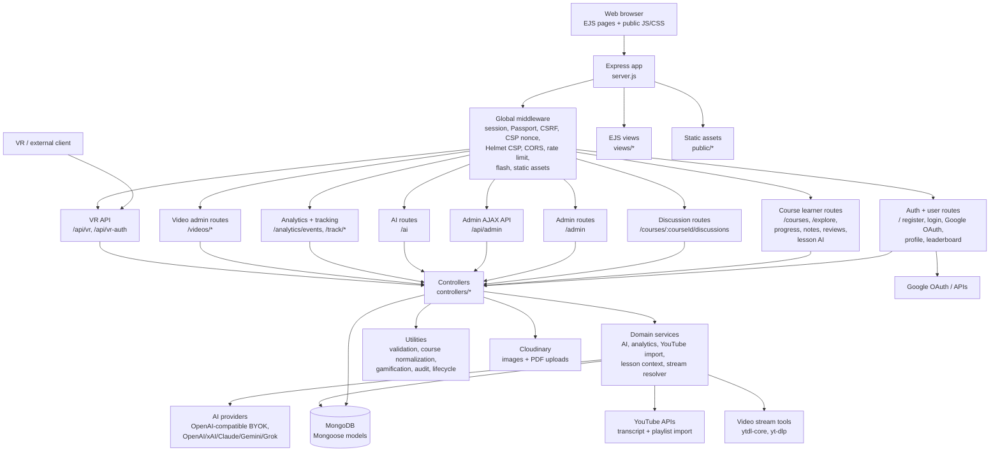
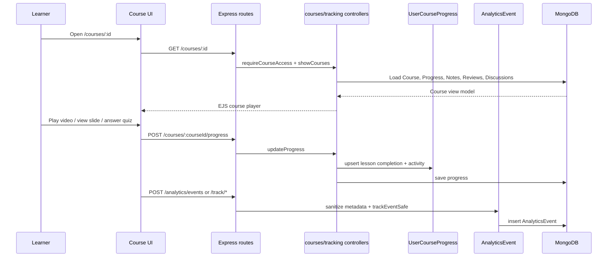
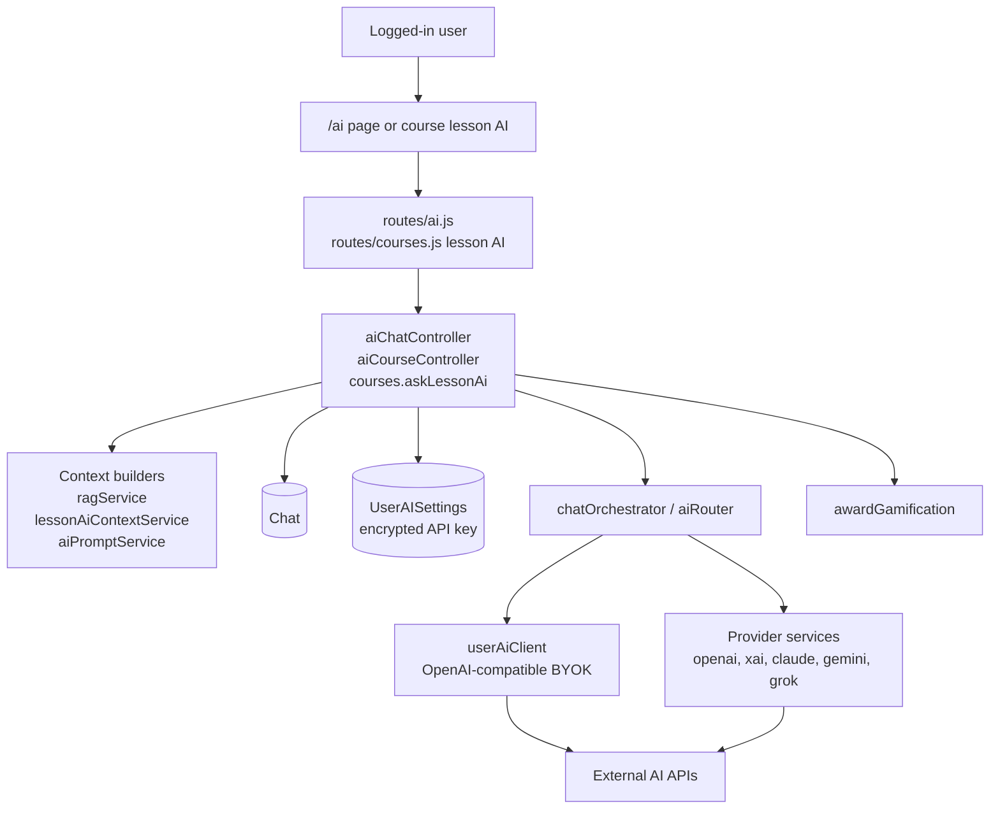
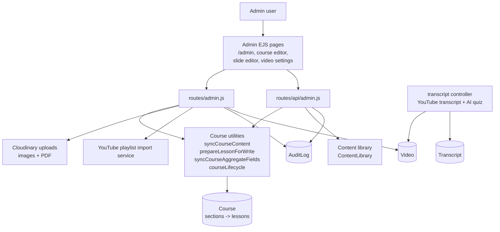
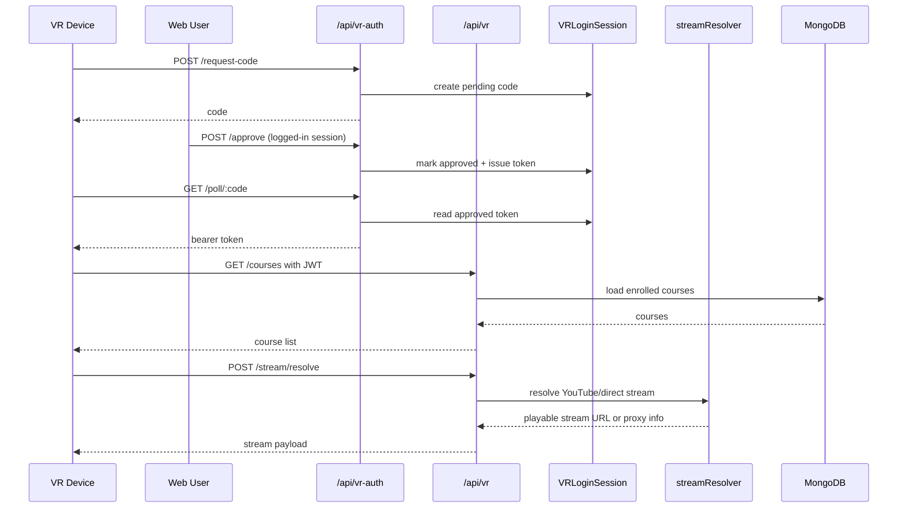
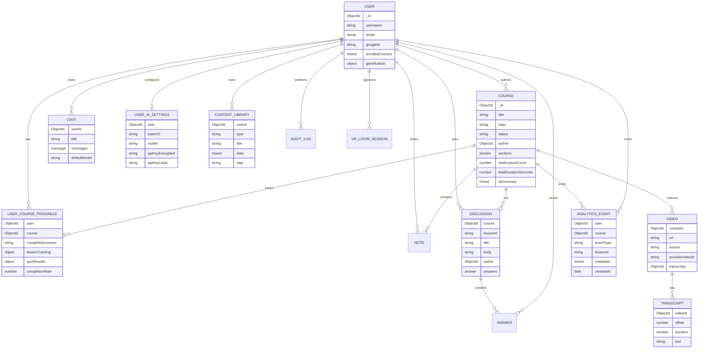

# Edumy System Overview

Tai lieu nay tom tat kien truc hien tai cua Edumy theo code trong repo. Cac so do dung Mermaid, co the xem truc tiep tren GitHub, Markdown Preview hoac mermaid.live.

## 1. Kien Truc Tong Quan

## 2. Request Pipeline

```mermaid
flowchart LR
  Req["HTTP request"] --> Body["urlencoded/json parsers"]
  Body --> Method["method-override"]
  Method --> Static["static /public"]
  Static --> Logging["morgan + compression"]
  Logging --> Cors["CORS"]
  Cors --> Limit["global rate limit"]
  Limit --> Session["Mongo session store"]
  Session --> Flash["flash messages"]
  Flash --> Csrf{"CSRF required?"}
  Csrf -- "normal web/API" --> CsrfProtect["csrfProtection"]
  Csrf -- "/api/vr* exceptions" --> CsrfTokenOnly["csrfTokenOnly"]
  CsrfProtect --> CspNonce["CSP nonce locals"]
  CsrfTokenOnly --> CspNonce
  CspNonce --> Helmet["Helmet CSP"]
  Helmet --> Passport["Passport init/session"]
  Passport --> Locals["res.locals\ncurrentUser, csrfToken,\nnotifications, flash"]
  Locals --> Routes["Mounted route modules"]
  Routes --> Err["404 + centralized error handler"]
```

## 3. Route Map

```mermaid
flowchart TD
  App["server.js route mounts"]

  App --> R1["/ -> users + home\nregister/login/logout\nGoogle OAuth\nprofile, leaderboard"]
  App --> R2["/explore\ncourse discovery, preview, enroll"]
  App --> R3["/courses\nlearner course pages\ncreate/update/delete for admins\nprogress, notes, quiz results, lesson AI"]
  App --> R4["/courses/:id/reviews\nreview create/delete"]
  App --> R5["/courses/:courseId/discussions\nQ&A list/show/create\nanswers, votes, accept/delete"]
  App --> R6["/admin\nadmin dashboard/editor\ncourse lifecycle\nslides, quizzes, video settings\nYouTube import, Grok setup"]
  App --> R7["/api/admin\nAJAX section/lesson/library CRUD"]
  App --> R8["/ai\nchat, streaming chat, settings,\nquiz/slide generation"]
  App --> R9["/videos\ntranscript fetch + AI quiz from video"]
  App --> R10["/analytics/events\nclient analytics ingestion"]
  App --> R11["/track\nlearning interaction tracking"]
  App --> R12["/api/vr-auth\nVR device pairing"]
  App --> R13["/api/vr\nVR course/lesson/progress\nstream resolve/proxy"]
  App --> R14["/health\nruntime health check"]
```

## 4. Learning Flow

## 5. AI Flow

## 6. Admin Content Flow

## 7. VR Flow

## 8. Data Model Overview

## 9. Main Runtime Responsibilities

- `server.js`: boot Express, connect MongoDB, register middleware, mount routes, expose `/health`, handle errors and graceful shutdown.
- `routes/*`: define HTTP surfaces. Most user-facing pages are server-rendered EJS; AJAX/API endpoints return JSON.
- `controllers/*`: coordinate request handling, Mongoose reads/writes, rendering and service calls.
- `models/*`: Mongoose schemas for users, courses, progress, discussions, AI chat/settings, analytics, library, video transcripts, audit logs and VR login sessions.
- `services/ai/*`: BYOK AI client, provider adapters, chat orchestration, RAG/context, slide/quiz/course summary generation.
- `services/youtube/*` and `controllers/transcript.js`: playlist import, transcript fetching, video-derived AI quiz generation.
- `services/analytics*`: learning analytics aggregation and sanitized event ingestion.
- `public/javascripts/show/*`: client-side course player state/rendering for video, slides, quizzes, progress and lesson AI.
